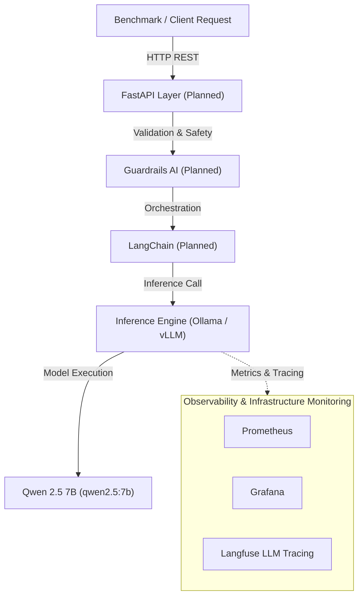

# InferenceOps: Cost-Optimized LLM Inference on AWS

> **Benchmarking, Observability, Guardrails & Cost Optimization for Open-Source LLMs**

[](https://github.com/AtulRajput01/inferenceops)
[](LICENSE)

---

## 🎯 Overview & Engineering Philosophy

**InferenceOps** is an end-to-end LLM inference platform designed to systematically measure, benchmark, and optimize the infrastructure economics and runtime performance of serving open-source Large Language Models (LLMs) on AWS.

Rather than treating LLM deployment as a black box, **InferenceOps** follows an incremental, benchmark-driven engineering approach. Every architectural enhancement—from raw containerized runtime to API wrappers, observability, guardrails, quantization, GPU acceleration, and Kubernetes orchestration—is empirically measured against baseline metrics.

### Key Questions Addressed
- What is the actual throughput (**tokens/sec**) and Time To First Token (**TTFT**) across CPU vs. GPU configurations?
- How do latency distribution metrics (**P50 / P95 / P99**) degrade under increasing concurrency?
- What is the precise overhead added by **Observability** (Prometheus, Grafana, Langfuse) and **Safety/Guardrails** (Guardrails AI)?
- How do serving runtimes (**Ollama**, **llama.cpp**, **vLLM**) compare under identical workloads?
- What is the true infrastructure serving **cost per 1K and 1M tokens**?

---

## 🏗 System Architecture



---

## 💻 Baseline Infrastructure Specifications

Current baseline evaluation is conducted on an AWS EC2 compute instance in `ap-south-1` (Mumbai):

| Hardware / Environment | Specification |
| :--- | :--- |
| **Provider & Region** | AWS EC2 — `ap-south-1` (Mumbai) |
| **vCPU / Physical Cores** | 8 vCPUs / 4 Physical Cores (8 Threads) |
| **CPU Architecture** | Intel Xeon Platinum 8488C (x86_64, KVM) |
| **CPU Extensions** | AVX2, AVX-512, AVX-512 BF16, AVX-512 VNNI, AMX BF16, AMX INT8 |
| **Memory & Swap** | 30 GiB RAM + 8 GiB Swap |
| **Container Engine** | Docker `29.8.0` / Docker Compose `5.5.1` |
| **Default Serving Model** | Qwen 2.5 7B (`qwen2.5:7b`, ~4.7 GB quantized parameters) |

---

## 📂 Repository Structure

```
inferenceops/
├── api/                   # FastAPI application & endpoint handlers (Planned - Exp 5)
├── benchmark/             # Benchmarking suite & performance scripts
│   ├── results/           # Timestamped JSON output logs (gitignored)
│   ├── benchmark.py       # Python benchmark script for sequential/batch performance testing
│   └── requirements.txt   # Python dependencies
├── dashboard/             # Interactive web dashboard UI & visualizer
│   ├── index.html         # Dashboard HTML application
│   ├── styles.css         # Dark glassmorphism styles & design system
│   └── app.js             # Chart.js visualization logic & JSON file parser
├── ollama/                # Persistent volume storage for Ollama model weights (gitignored)
├── docker-compose.yml     # Container service orchestration
├── .gitignore             # Git exclusion policies
└── README.md              # Project master documentation
```

---

## 💻 Interactive Dashboard UI

We provide an interactive, dark-mode glassmorphism dashboard UI (`dashboard/`) to visually analyze latency distributions, TTFT, throughput stability trends, and infrastructure serving cost economics.

### Launch Dashboard Container
Run Docker Compose to build and start both the Ollama runtime (`:11434`) and the Dashboard UI (`:8080`):
```bash
docker compose up -d
```
Navigate to `http://localhost:8080` (or `http://<EC2-IP>:8080`) in your web browser. You can load any benchmark JSON result file using the **Load JSON Result** button or drag-and-drop.

---

## 🚀 Quickstart Guide

### 1. Prerequisites
- Docker & Docker Compose
- Python 3.10+

### 2. Start the Inference Engine
Run Docker Compose to start the containerized Ollama service:
```bash
docker compose up -d
```

Verify service health:
```bash
docker ps
```

### 3. Pull the Target Model
Download Qwen 2.5 7B into the running container:
```bash
docker exec -it inferenceops-ollama ollama pull qwen2.5:7b
```

---

## 📊 Benchmarking Baseline

We provide a zero-dependency Python script (`benchmark/benchmark.py`) to record detailed metrics for inference requests.

### Basic Usage

To run a benchmark (1 warmup request + 10 sequential warm benchmark requests):
```bash
python3 benchmark/benchmark.py --url http://localhost:11434/api/generate --num-requests 10
```

### Advanced Usage & Remote Testing
```bash
python3 benchmark/benchmark.py \
  --url http://inference.atulrajput.space/api/generate \
  --model qwen2.5:7b \
  --num-requests 10 \
  --prompt "Explain Kubernetes container orchestration and pod scheduling in under 100 words."
```

### Collected Metrics
- **Client Latency (s)**: Wall-clock end-to-end response time.
- **Time To First Token (TTFT)**: Estimated duration prior to initial generation (`load_duration + prompt_eval_duration`).
- **Prompt Evaluation Duration & Tokens**: Pre-fill processing statistics.
- **Generation Throughput (tokens/sec)**: `eval_count / eval_duration`.
- **Statistical Percentiles**: Latency Mean, P50 (Median), P95, P99, Min, and Max.

All results are automatically calculated and stored as structured JSON records in `benchmark/results/`.

---

## 🗺 Experiment Roadmap

- [x] **Experiment 1: CPU Baseline** — Initial deployment of Ollama + Qwen 2.5 7B on AWS EC2 CPU.
- [x] **Experiment 2: Repeatable Benchmark Tooling** — Standardized Python benchmarking suite & metric tracking.
- [ ] **Experiment 3: Concurrency & Load Testing** — Saturation testing under varying request concurrency (10–200 req/min).
- [ ] **Experiment 4: Observability Layer** — Prometheus, Grafana & Langfuse tracing + overhead assessment.
- [ ] **Experiment 5: API Layer** — FastAPI gateway integration & direct vs. proxied latency evaluation.
- [ ] **Experiment 6: Orchestration Layer** — LangChain integration and performance overhead measurement.
- [ ] **Experiment 7: Guardrails & Safety** — Guardrails AI evaluation and validation latency impact.
- [ ] **Experiment 8: Quantization Benchmark** — Comparing FP16, Q8, Q6, Q4 model performance & RAM usage.
- [ ] **Experiment 9: Runtime Comparison** — Benchmarking Ollama vs. `llama.cpp` engine.
- [ ] **Experiment 10: GPU Acceleration Baseline** — Evaluating GPU serving performance (AWS G6/G6e or RTX 3060).
- [ ] **Experiment 11: Production Serving with vLLM** — High-throughput serving comparison using vLLM PagedAttention.
- [ ] **Experiment 12: CPU vs. GPU Infrastructure Economics** — Cost per request and cost per 1M tokens comparison.
- [ ] **Experiment 13: Kubernetes Deployment** — EKS cluster migration with custom scheduling & probes.
- [ ] **Experiment 14: Infrastructure as Code** — Full Terraform provisioning (VPC, SG, EC2, EKS, ALB).
- [ ] **Experiment 15: CI/CD Pipeline** — GitHub Actions automated build, test, ECR push & EKS deployment.

---

## 📜 License

This project is open-source under the [MIT License](LICENSE).
