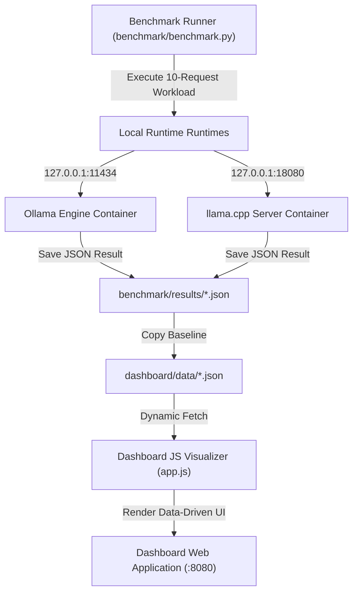

# InferenceOps: Cost-Optimized LLM Inference on AWS

> **Benchmarking, Observability, Guardrails & Cost Optimization for Open-Source LLMs**

[](https://github.com/AtulRajput01/inferenceops)
[](LICENSE)

---

## 🌐 Public Endpoints & Active Services

| Service | Protocol / Route | Target Endpoint URL | Note / Purpose |
| :--- | :--- | :--- | :--- |
| **Dashboard UI** | Web Application | `http://inferencex.atulrajput.space/` | Data-Driven Performance Visualizer |
| **Public Ollama API** | Native Ollama REST | `http://inference.atulrajput.space/ollama/` | Public Ollama proxy endpoint |
| **Public llama.cpp API** | OpenAI-Compatible Chat | `http://inference.atulrajput.space/llama/v1/chat/completions` | Public llama.cpp chat completions endpoint |
| **Local Ollama Backend** | Local Machine Benchmark | `http://127.0.0.1:11434/api/generate` | Direct local endpoint (eliminates proxy latency) |
| **Local llama.cpp Backend** | Local Machine Benchmark | `http://127.0.0.1:18080/v1/chat/completions` | Direct local endpoint (eliminates proxy latency) |

---

## 🎯 Overview & Engineering Philosophy

**InferenceOps** is an end-to-end LLM inference platform designed to systematically measure, benchmark, and optimize the infrastructure economics and runtime performance of serving open-source Large Language Models (LLMs) on AWS.

Rather than treating LLM deployment as a black box, **InferenceOps** follows an empirical, benchmark-driven engineering approach. Every serving runtime (**Ollama**, **llama.cpp**, **vLLM**)—from raw containerized engines to API wrappers, observability, guardrails, and quantization—is evaluated under strict, controlled benchmark workloads.

### Key Questions Addressed
- What is the actual generation throughput (**tokens/sec**) and Time To First Token (**TTFT**) across serving runtimes?
- How do latency percentile distributions (**P50 / P95 / P99**) degrade under sequential or concurrent workloads?
- What is the precise wall-clock **benchmark execution duration** excluding model loading and warmup phases?
- How do serving runtimes (**Ollama**, **llama.cpp**, **vLLM**) compare under identical hardware and prompt workloads?
- What is the true estimated infrastructure serving **cost per 1M tokens**?

---

## 🏗 System Architecture & Data Flow



### Data Flow Breakdown
1. **Benchmark Runner**: `benchmark/benchmark.py` executes standardized requests against local runtime endpoints (`127.0.0.1:11434` or `127.0.0.1:18080`).
2. **JSON Storage**: Detailed request metrics and summary statistics are saved under `benchmark/results/`.
3. **Dashboard Data**: Active baseline JSON files are copied to `dashboard/data/` (`ec2_cpu_baseline.json` and `llamacpp_ec2_cpu_baseline.json`).
4. **Data-Driven UI**: `dashboard/app.js` dynamically fetches baseline datasets and populates the Runtime Comparison Matrix, throughput charts, percentiles, and cost cards without hardcoded performance fallbacks.

---

## 🔬 Controlled Benchmark Methodology

To ensure strict scientific rigor and head-to-head reproducibility, all runtime evaluations follow an identical methodology:

| Benchmark Parameter | Standardized Specification |
| :--- | :--- |
| **Model Family** | Qwen 2.5 7B (`qwen2.5:7b` / `Qwen2.5-7B-Instruct-GGUF`) |
| **Quantization** | `Q4_K_M` |
| **Hardware** | AWS EC2 c7i (8 vCPU Intel Xeon Platinum 8488C, 30 GB RAM) |
| **Warmup Requests** | `1` (excluded from statistics, used for model load timing) |
| **Warm Benchmark Requests** | `10` sequential requests |
| **Concurrency (c)** | `1` worker thread |
| **Temperature** | `0.0` (deterministic output evaluation) |
| **Standardized Prompt** | `"Explain Kubernetes container orchestration and pod scheduling in under 100 words."` |

> ⚠️ **Benchmark Isolation Requirement**: The EC2 compute node has 8 vCPUs and ~30 GiB RAM. **Never run Ollama and llama.cpp benchmarks concurrently**. To prevent CPU core contention from invalidating results, stop non-target containers during evaluation (`docker compose stop ollama` or `docker compose stop llama-cpp`).

---

## 💻 Baseline Infrastructure & Runtime Matrix

Current evaluation status across supported serving runtimes:

| Runtime Engine | Model Format / Quant | Status | Benchmark Endpoint | Hardware |
| :--- | :--- | :--- | :--- | :--- |
| **Ollama** | Native Ollama (`qwen2.5:7b` Q4_K_M) | **Active Baseline** | `http://127.0.0.1:11434/api/generate` | AWS EC2 (8 vCPU Intel Xeon) |
| **llama.cpp** | GGUF (`Qwen2.5-7B-Instruct-GGUF` Q4_K_M) | **Benchmarked** | `http://127.0.0.1:18080/v1/chat/completions` | AWS EC2 (8 vCPU Intel Xeon) |
| **vLLM** | Planned | **Planned (No benchmark data)** | N/A | AWS EC2 (GPU / CPU) |

---

## 📊 Benchmarking Suite & Execution Commands

### 1. Execute Benchmark for Ollama
Stop `llama-cpp` to ensure isolation, then execute:
```bash
docker compose stop llama-cpp

python3 benchmark/benchmark.py \
  --url http://127.0.0.1:11434/api/generate \
  --api-type ollama \
  --model qwen2.5:7b \
  --runtime Ollama \
  --num-requests 10 \
  --warmup 1 \
  --concurrency 1 \
  --temperature 0.0 \
  --tag cpu_baseline_ollama \
  --output-dir benchmark/results
```

### 2. Execute Benchmark for llama.cpp
Stop `ollama` to ensure isolation, then execute:
```bash
docker compose stop ollama

python3 benchmark/benchmark.py \
  --url http://127.0.0.1:18080/v1/chat/completions \
  --api-type llamacpp \
  --model "Qwen 2.5 7B Q4_K_M GGUF" \
  --runtime llama.cpp \
  --num-requests 10 \
  --warmup 1 \
  --concurrency 1 \
  --temperature 0.0 \
  --tag cpu_baseline_llamacpp \
  --output-dir benchmark/results
```

### 3. Sync Results to Dashboard Data
After running official 10-request benchmarks, copy the generated JSON files into `dashboard/data/`:
```bash
cp benchmark/results/cpu_baseline_ollama_*.json dashboard/data/ec2_cpu_baseline.json
cp benchmark/results/cpu_baseline_llamacpp_*.json dashboard/data/llamacpp_ec2_cpu_baseline.json
```

---

## 📋 JSON Result Schema & Metric Definitions

All benchmark executions generate structured JSON logs containing metadata, detailed request breakdowns, and summary statistics:

```json
{
  "metadata": {
    "run_id": "RUN-20260916-LLAMACPP-001",
    "runtime": "llama.cpp",
    "endpoint": "http://127.0.0.1:18080/v1/chat/completions",
    "model": "Qwen 2.5 7B Q4_K_M GGUF",
    "model_format": "GGUF Q4_K_M",
    "quantization": "Q4_K_M",
    "hardware": "AWS EC2 c7i / 8 vCPU Intel Xeon Platinum 8488C / 30GB RAM",
    "timestamp_utc": "20260916_120000",
    "configuration": {
      "url": "http://127.0.0.1:18080/v1/chat/completions",
      "model": "Qwen 2.5 7B Q4_K_M GGUF",
      "prompt": "Explain Kubernetes container orchestration and pod scheduling in under 100 words.",
      "num_requests": 10,
      "warmup_requests": 1,
      "concurrency": 1,
      "temperature": 0.0
    }
  },
  "summary_statistics": {
    "count": 10,
    "successful_requests": 10,
    "failed_requests": 0,
    "cpu_utilization_pct": 82.1,
    "average_latency": 9.815,
    "p50_latency": 9.752,
    "p95_latency": 11.120,
    "p99_latency": 11.185,
    "min_latency": 7.510,
    "max_latency": 11.210,
    "generation_throughput_tokens_sec": 8.51,
    "benchmark_duration_s": 98.15,
    "warmup_duration_s": 12.10,
    "total_wall_clock_duration_s": 110.25,
    "tokens": {
      "prompt_tokens": 460,
      "generated_tokens": 821,
      "total_tokens": 1281
    }
  }
}
```

### Metric Definitions
- **`benchmark_duration_s`**: Wall-clock duration of the warm benchmark phase (excludes model loading and warmup runs).
- **`warmup_duration_s`**: Wall-clock duration spent executing warmup requests (includes initial model weight loading into memory).
- **`total_wall_clock_duration_s`**: Total script execution time from start to completion.
- **`generation_throughput_tokens_sec`**: Mean generation throughput ($\text{output tokens} / \text{eval duration}$).
- **`client_latency_s`**: End-to-end latency measured by the HTTP client from request dispatch to final byte received.

---

## 💰 Infrastructure Cost Methodology

All infrastructure serving costs are computed using an **ESTIMATED METHODOLOGY** based on target cloud hourly rates:

$$\text{Cost / 1M Tokens} = \frac{\text{AWS EC2 Hourly Rate (\$0.384)}}{\text{Throughput (tok/s)} \times 3600} \times 1,000,000$$

- **Target Node**: AWS EC2 `c7i.2xlarge` (8 vCPU Intel Xeon Platinum 8488C / 30GB RAM).
- **AWS On-Demand Hourly Rate**: `$0.384 / hour` (`$9.216 / day`).
- **Cost Allocation**: Input prompt tokens (30% weight) vs Output generated tokens (70% weight).
- **Transparency Note**: This cost figure is an estimated infrastructure efficiency metric based on observed benchmark throughput, not an exact AWS billing statement.

---

## 📜 License

This project is open-source under the [MIT License](LICENSE).
