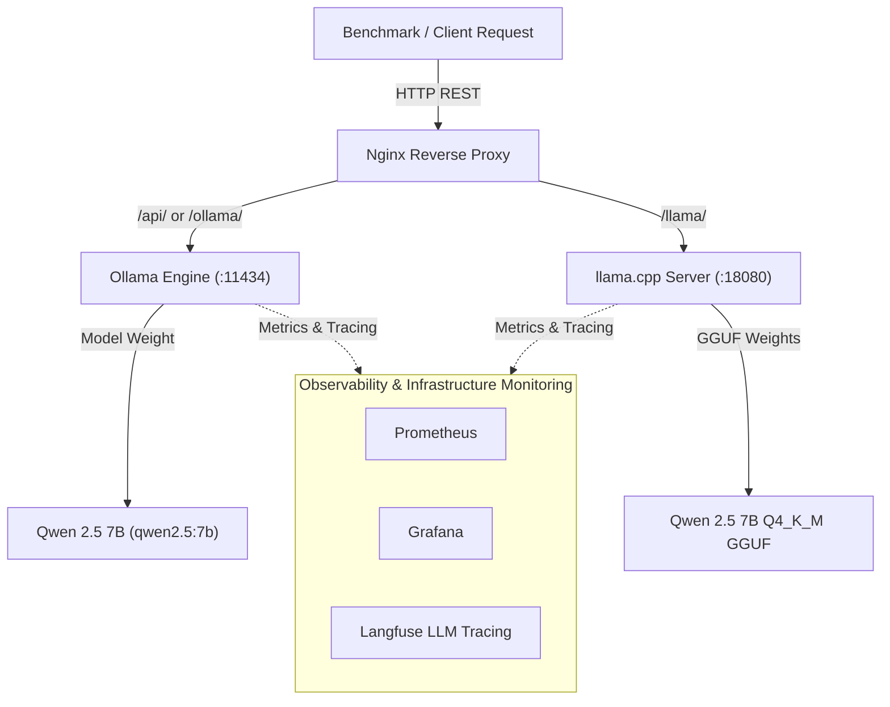

# InferenceOps: Cost-Optimized LLM Inference on AWS

> **Benchmarking, Observability, Guardrails & Cost Optimization for Open-Source LLMs**

[](https://github.com/AtulRajput01/inferenceops)
[](LICENSE)

---

## 🌐 Public Endpoints & Active Services

| Service | Protocol / Route | Target Endpoint URL |
| :--- | :--- | :--- |
| **Dashboard UI** | Web Application | `http://inferencex.atulrajput.space/` |
| **Public Ollama API** | Native Ollama REST | `http://inference.atulrajput.space/ollama/` |
| **Public llama.cpp API** | OpenAI-Compatible Chat | `http://inference.atulrajput.space/llama/v1/chat/completions` |
| **Local Ollama Backend** | Local Machine Benchmark | `http://127.0.0.1:11434/api/generate` |
| **Local llama.cpp Backend** | Local Machine Benchmark | `http://127.0.0.1:18080/v1/chat/completions` |

---

## 🎯 Overview & Engineering Philosophy

**InferenceOps** is an end-to-end LLM inference platform designed to systematically measure, benchmark, and optimize the infrastructure economics and runtime performance of serving open-source Large Language Models (LLMs) on AWS.

Rather than treating LLM deployment as a black box, **InferenceOps** follows an incremental, benchmark-driven engineering approach. Every architectural enhancement—from raw containerized runtime to API wrappers, observability, guardrails, quantization, GPU acceleration, and Kubernetes orchestration—is empirically measured against baseline metrics.

### Key Questions Addressed
- What is the actual throughput (**tokens/sec**) and Time To First Token (**TTFT**) across CPU vs. GPU configurations?
- How do latency distribution metrics (**P50 / P95 / P99**) degrade under increasing concurrency?
- What is the precise overhead added by **Observability** (Prometheus, Grafana, Langfuse) and **Safety/Guardrails** (Guardrails AI)?
- How do serving runtimes (**Ollama**, **llama.cpp**, **vLLM**) compare under identical workloads?
- What is the true infrastructure serving **cost per 1M tokens**?

---

## 🏗 System Architecture



---

## 💻 Baseline Infrastructure Specifications

Current baseline evaluation is conducted on an AWS EC2 compute instance in `ap-south-1` (Mumbai):

| Hardware / Environment | Specification |
| :--- | :--- |
| **Provider & Region** | AWS EC2 — `ap-south-1` (Mumbai) |
| **vCPU / Physical Cores** | 8 vCPUs / 4 Physical Cores (8 Threads) |
| **CPU Architecture** | Intel Xeon Platinum 8488C (x86_64, KVM) |
| **CPU Extensions** | AVX2, AVX-512, AVX-512 BF16, AVX-512 VNNI, AMX BF16, AMX INT8 |
| **Memory & Swap** | 30 GiB RAM + 8 GiB Swap |
| **Container Engine** | Docker `29.8.0` / Docker Compose `5.5.1` |
| **Default Serving Models** | Ollama: `qwen2.5:7b` \| llama.cpp: `Qwen2.5-7B-Instruct-GGUF Q4_K_M` |

---

## 📂 Repository Structure

```
inferenceops/
├── api/                   # FastAPI application & endpoint handlers (Planned - Exp 5)
├── benchmark/             # Benchmarking suite & performance scripts
│   ├── results/           # Timestamped JSON output logs
│   │   ├── cpu_baseline_ollama_20260915_070200.json
│   │   └── cpu_baseline_llamacpp_20260915_184500.json
│   ├── benchmark.py       # Multi-runtime Python benchmark runner
│   └── requirements.txt   # Python dependencies
├── dashboard/             # Interactive web dashboard UI & visualizer
│   ├── data/              # Preloaded JSON benchmark datasets
│   ├── index.html         # Dashboard HTML application
│   ├── styles.css         # Dark glassmorphism styles & design system
│   ├── app.js             # Chart.js visualizer & dynamic multi-runtime loader
│   └── nginx.conf         # Dashboard & reverse proxy Nginx configuration
├── llama.cpp/             # Volume mount for llama.cpp GGUF model weights
├── ollama/                # Volume mount for Ollama model weights
├── docker-compose.yml     # Container service orchestration
├── .gitignore             # Git exclusion policies
└── README.md              # Project master documentation
```

---

## 🚀 Quickstart & Docker Compose

### 1. Start Containerized Services
Run Docker Compose to launch Ollama (`:11434`), llama.cpp (`:18080`), and Dashboard (`:8080`):
```bash
docker compose up -d
```

Verify service status:
```bash
docker compose ps
```

---

## 📊 Benchmarking Suite & Execution Commands

We provide a repeatable Python benchmark runner (`benchmark/benchmark.py`) supporting both native Ollama API and OpenAI-compatible llama.cpp API endpoints.

> ℹ️ **Benchmark Methodology Note**: Official performance benchmarks measure local backend endpoints directly (`http://127.0.0.1:18080` and `http://127.0.0.1:11434`) to eliminate reverse proxy latency.

### 1. Execute Benchmark for Ollama
```bash
python3 benchmark/benchmark.py \
  --url http://127.0.0.1:11434/api/generate \
  --api-type ollama \
  --model qwen2.5:7b \
  --runtime Ollama \
  --num-requests 10 \
  --warmup 1 \
  --concurrency 1 \
  --temperature 0.0 \
  --tag cpu_baseline_ollama \
  --output-dir benchmark/results
```

### 2. Execute Benchmark for llama.cpp
```bash
python3 benchmark/benchmark.py \
  --url http://127.0.0.1:18080/v1/chat/completions \
  --api-type llamacpp \
  --model "Qwen 2.5 7B Q4_K_M GGUF" \
  --runtime llama.cpp \
  --num-requests 10 \
  --warmup 1 \
  --concurrency 1 \
  --temperature 0.0 \
  --tag cpu_baseline_llamacpp \
  --output-dir benchmark/results
```

### 3. Public Endpoint API Testing
To test against public Nginx endpoints:
```bash
# Public llama.cpp OpenAI-compatible Chat endpoint
curl -X POST http://inference.atulrajput.space/llama/v1/chat/completions \
  -H "Content-Type: application/json" \
  -d '{"model": "Qwen 2.5 7B Q4_K_M GGUF", "messages": [{"role": "user", "content": "Hello!"}], "temperature": 0}'

# Public Ollama endpoint
curl -X POST http://inference.atulrajput.space/ollama/api/generate \
  -H "Content-Type: application/json" \
  -d '{"model": "qwen2.5:7b", "prompt": "Hello!", "stream": false}'
```

---

## 📋 JSON Result Schema

All benchmark executions generate structured JSON files saved under `benchmark/results/`:

```json
{
  "metadata": {
    "run_id": "RUN-20260915-LLAMACPP-001",
    "runtime": "llama.cpp",
    "endpoint": "http://127.0.0.1:18080/v1/chat/completions",
    "timestamp_utc": "20260915_184500",
    "system_info": {
      "platform": "Linux-6.8.0-139-generic-x86_64",
      "hardware": "AWS EC2 c7i / 8 vCPU Intel Xeon Platinum 8488C / 30GB RAM",
      "runtime_engine": "llama.cpp"
    },
    "configuration": {
      "url": "http://127.0.0.1:18080/v1/chat/completions",
      "model": "Qwen 2.5 7B Q4_K_M GGUF",
      "prompt": "Explain Kubernetes container orchestration and pod scheduling in under 100 words.",
      "num_requests": 10,
      "warmup_requests": 1,
      "concurrency": 1,
      "temperature": 0.0
    }
  },
  "summary_statistics": {
    "count": 10,
    "successful_requests": 10,
    "failed_requests": 0,
    "client_latency_s": { "mean": 9.815, "p50": 9.752, "p95": 11.120, "p99": 11.185, "min": 7.510, "max": 11.210 },
    "ttft_s": { "mean": 0.078, "p50": 0.077, "p95": 0.081, "p99": 0.082, "min": 0.075, "max": 0.083 },
    "tokens_per_second": { "mean": 8.51, "p50": 8.51, "p95": 8.54, "p99": 8.55, "min": 8.48, "max": 8.55 },
    "tokens": { "total_prompt_tokens": 460, "total_eval_tokens": 821, "total_tokens": 1281 }
  }
}
```

---

## 📜 License

This project is open-source under the [MIT License](LICENSE).
